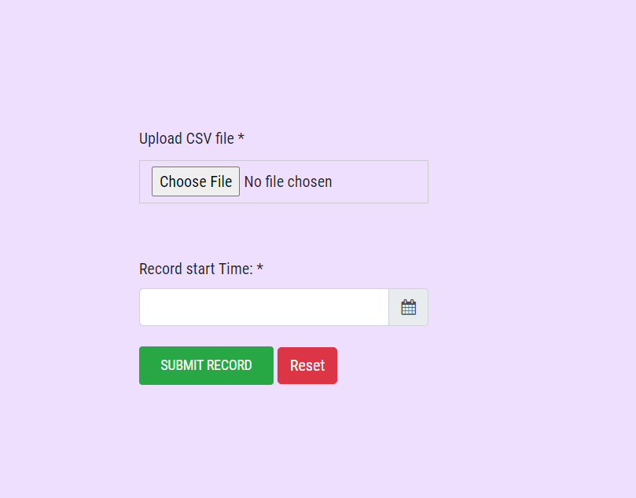
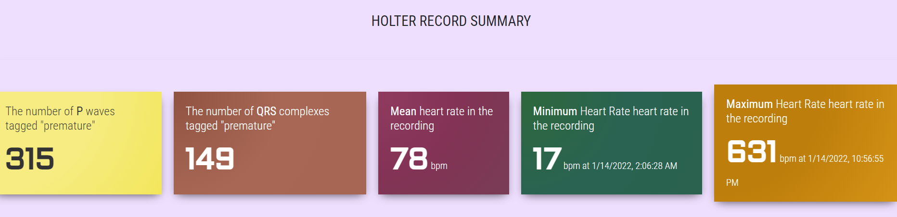

# cardiologs_assignment

to run a project run

```
npm install
nodemon
```

Project summary: 

1. Form field that accept the CSV file and (Data and time) when the data in CSV was started recording



2. Sending the file using AXIOS after file validation is done
3. Upload the file using multer and Parsing the CSV file
4. Create a read Stream of the file and read that stream using readLine 
5. check if the file contain data in format we need and if yes, perform computation needed (delineation)
6. Return result to the front-end



7. Display the result desired


